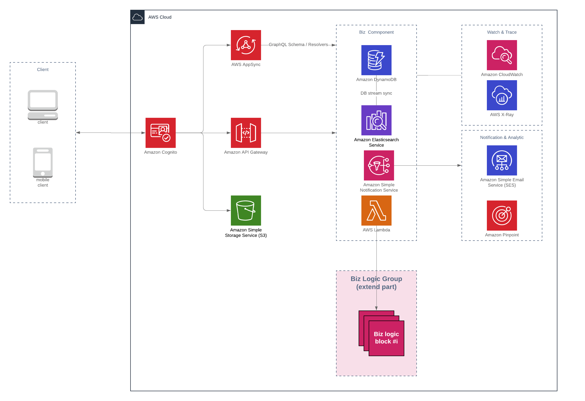

# Infrastructure as Code with AWS

At [SK-Global](https://sk-global.biz/) we have change to work with many projects using different type of frameworks and infrastructures, and we also paid a lot a time to pay for our technical debt to refactor the source code & infrastructure when thing scaling up.
It become our [critical topic](https://medium.com/sk-geek/adopting-the-base-sbp-at-skg-why-we-move-to-microservices-4461f984a72e) because we need delivery our product to the market as quick as possible and can continue using the source code after that.

So we decided to step back and build our first source code base package with can help us have a ready and steady starting point for our next projects. Quickly the below characteristics about the source code base come to our mind

* Amazon Web Service - why, because it is major and supply almost weapons need for project.
* Infrastructure as Code - if you have already worked with AWS Console UI, definitely you understand configure by code is much more connivence.
* Serverless - function as a Service, no traffic no payment.
* Security - let the security game be in charged by the AWS Cognito, we rely on them.

Ok let see what we got in the package in next chapter.

> This source code package is based on AWS serverless architecture so you need basic knowledge about [AWS CloudFormation](https://aws.amazon.com/cloudformation) and [Serverless framework](https://serverless.com/) for development and coding.

## Structure of Package

This is the basic infrastructure we think necessary for almost real life project.

* Authentication & Authorization with Amazon Cognito
* Storage with Amazon S3
* Database with Amazon DynamoDB
* Searching with Amazon Elastic Search
* BizLogic with Amazon Lambda 
* Push, Email, PubSub with Amazon SNS
* Tracing with Amazon X-Ray
* Watching with Amazon CloudWatch
* CI/CD witch AWS CodeBuild

This may be too much for the starter, so we separated source code base into 3 parts like below for easier to follow.

### Starter

This is a clean starting point for project, it contain a ready to go NodeJS with AWS environment backend. You can modify the configuration to have your desire environment easily, let start with the [Starter](https://github.com/skglobal-jsc/Infrastructure-as-Code-with-AWS/tree/master/starter).

### Example

Still don't know how to start from Starter, don't worry we supply an example package which is based from the starter, implemented some basic Biz logics and contain frontend source code which can demonstrate how things work. Let deep dive with [Example](https://github.com/skglobal-jsc/Infrastructure-as-Code-with-AWS/tree/master/example).

### Real life project

How about expand the base package to become a real life project like [this one](https://hamaso.sk-global.io). Please [contact](https://sk-global.biz/) to us, we love to help with your idea.

---
This package base is a fully open source project, and we welcome contributions. We hope this package can be a good starting point for you to build a great next project. Happy coding!
