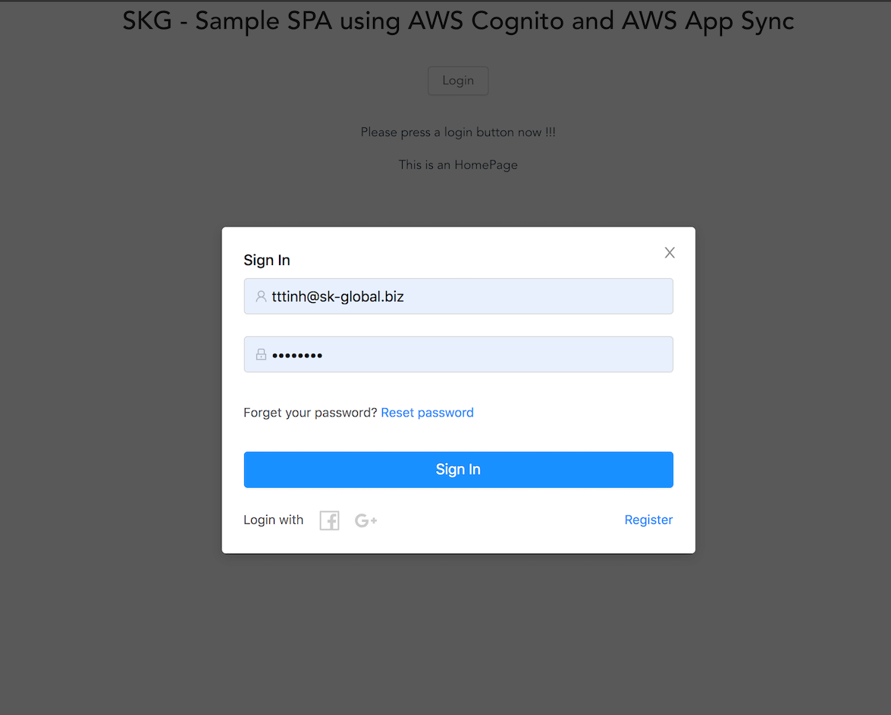
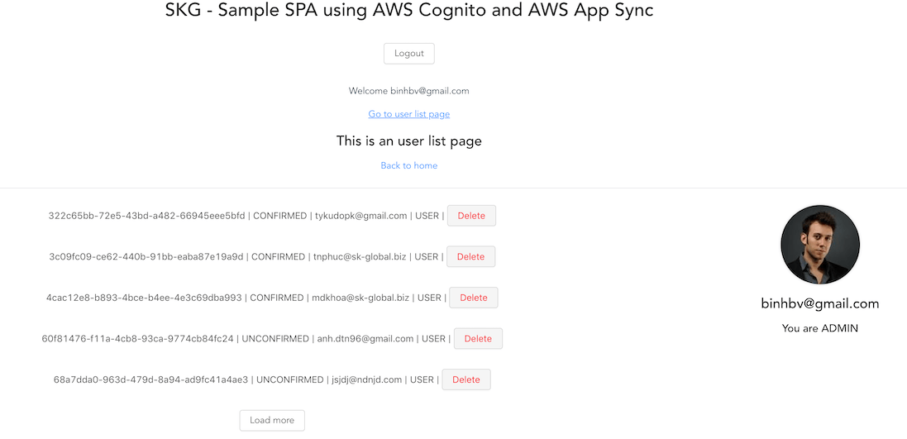
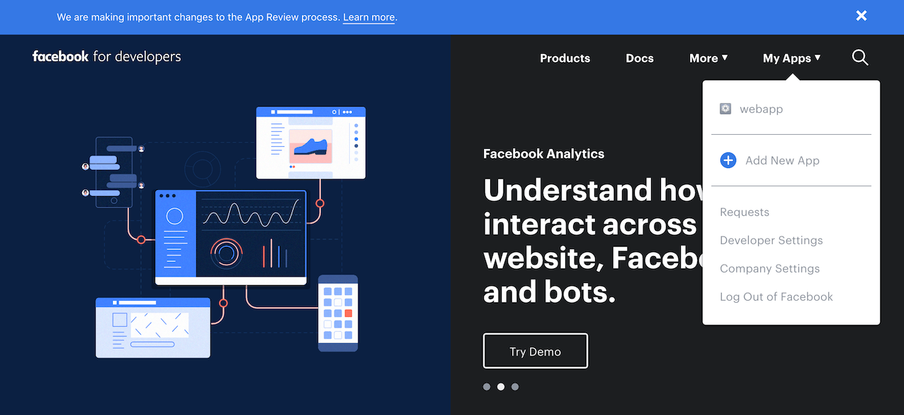
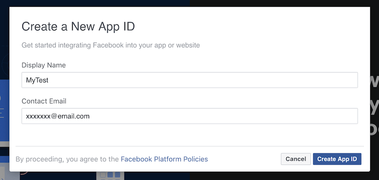
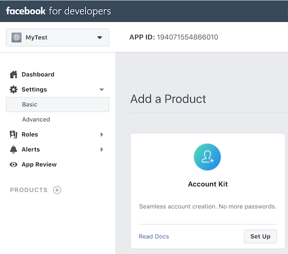
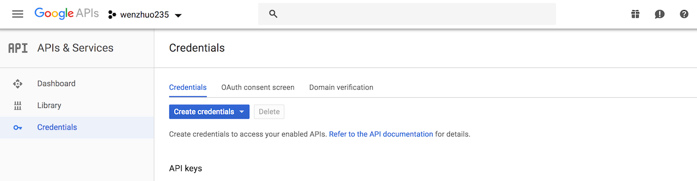

# Full Stack Serverless with AWS demonstration

Still don't know how to start from [Starter](https://github.com/skglobal-jsc/Infrastructure-as-Code-with-AWS/tree/master/starter), don't worry let start to discovery how to use the base package.

## Demonstration features

|Functions|Backend - NodeJS|Frontend - VueJS|Mobile - Flutter|
|:--|:-:|:-:|:-:|
|Sign In with Account, SNS|Amazon Cognito|amplify-js|amazon-cognito-identity-dart|
|Sign Up with Account|Amazon Cognito|amplify-js|amazon-cognito-identity-dart|
|Sign Out|Amazon Cognito|amplify-js|amazon-cognito-identity-dart|
|Account photo update|Amazon S3|amplify-js|http post|
|User list|Amazon Appsync|amplify-js|graphql|
|User list realtime update|Amazon Appsync|amplify-js|
|User delete|Amazon Appsync|amplify-js|graphql|
|User say hello|AWS Alambda||http post
|Push Notification|Amazon SNS|||
|Analytic|Amazon Pinpoint|||
|Tracing|Amazon X-Ray|||
|Alarm|Amazon CloudWatch|||

This is simple application which User can login to see list of member, change profile info and send hello message to another member.




## backend_nodejs

Server source code seed from [Starter](https://github.com/skglobal-jsc/Infrastructure-as-Code-with-AWS/tree/master/starter) package and included biz logic code and some convenience plugin.

**Checkout**

```sh
# Create a new project
svn export https://github.com/skglobal-jsc/Infrastructure-as-Code-with-AWS/trunk/exmple/backend_nodejs your-project-name
# Change into the newly created directory
cd your-project-name
```

**Update serverless.yml**

You should change service name before deploy

```
service: skg-sample # change service name
```

**Social Provider Setup**

Before adding a social provider to sample project, you must first create go to that provider and configure an application identifier as outlined below.

_Facebook Sign-In_

1. Create a [developer account with Facebook](https://developers.facebook.com/docs/facebook-login)
2. [Sign In](https://developers.facebook.com/) with your Facebook credentials.
3. From the *My Apps* menu, choose *Add New App*.

4. Give your Facebook app a name and choose *Create App ID*.

5. On the left navigation bar, choose *Settings* and then *Basic*.

6. Note the *App ID* and the *App Secret*. You will need them for the config file auth.json.

_Google Sign-In_

1. Go to the [Google developer console](https://console.developers.google.com).
2. On the left navigation bar, choose *Credentials*.

3. Create your OAuth2.0 credentials by choosing *OAuth client ID* from the *Create credentials* drop-down list.

4. Choose *Web application*.
5. Click *Create* twice.
6. Note the *OAuth client ID* and *client secret*. You will need them for the config file auth.json.
7. Choose *OK*.

**Update auth.json**

Open file `configs/auth.json` and update `FacebookClientId, FacebookClientSecret, GoogleClientId, GoogleClientSecret` which created above.

```
{
  "hostedUIProviderCreds": "[{\"ProviderName\":\"Facebook\",\"client_id\":\"FacebookClientId\",\"client_secret\":\"FacebookClientSecret\"},{\"ProviderName\":\"Google\",\"client_id\":\"GoogleClientId\",\"client_secret\":\"GoogleClientSecret\"}]",
  "hostedUIProviderMeta": "[{\"ProviderName\":\"Facebook\",\"authorize_scopes\":\"email,public_profile\",\"AttributeMapping\":{\"email\":\"email\",\"username\":\"id\",\"name\":\"name\",\"picture\":\"cover\"}},{\"ProviderName\":\"Google\",\"authorize_scopes\":\"openid email profile\",\"AttributeMapping\":{\"email\":\"email\",\"username\":\"sub\",\"name\":\"name\",\"picture\":\"picture\"}}]"
}
```

**Push notification Setup**

1. Create 2 platform applications. 1 for FCM, 1 for APN follow [this guide](https://docs.aws.amazon.com/sns/latest/dg/sns-mobile-application-as-subscriber.html).
2. Update `configs/push.json` with 2 platform applications which created above
```
{
  "applicationTopic": "${self:service}-${self:provider.stage}-App",
  "FCM_APP_ARN": "MY_FCM_APP_ARN",
  "APN_APP_ARN": "MY_APN_APP_ARN"
}
```

**Deploy back-end service**

```
serverless deploy -v
```
After deploy successful, a config file will be created at `output/aws-exports.json`. Use this file for configuring at the front-end side. Beside that, all information is written to stdout

## frontend_vuejs

Web application using VueJS framework and amplify-js library for play with AWS service.

**Checkout**

```sh
# Create a new project
svn export https://github.com/skglobal-jsc/Infrastructure-as-Code-with-AWS/trunk/exmple/frontend_vuejs your-project-name
# Change into the newly created directory
cd your-project-name
```

**Configuration**

After successfully deploy backend_nodejs, please download `aws-exports.js`, `schema.graphql`, `app-sync.js` and replace with existing files in the project. These files contain keys and project identity for using AWS service.

**Deploy**

```sh
# Run frontend_vuejs
npm i | yarn install
# Start the dev server
npm run dev | yarn dev
```

## mobile_flutter

Mobile application using cross platform Mobile framework - Flutter. Currently AWD Amplify library have not supported for Flutter yet but we worked around with a little tweak from [unofficial amplify for dart](https://github.com/skglobal-jsc/amazon-cognito-identity-dart-with-sns-sign-in).

```sh
# Create a new project
svn export https://github.com/skglobal-jsc/Infrastructure-as-Code-with-AWS/trunk/exmple/mobile_flutter your-project-name
# Change into the newly created directory
cd your-project-name
```

**Configuration**

Again, please use information in `aws-exports.js` file get from server to replace into `lib/entries/secret.dart` file.

**Deploy**

```sh
# Run mobile_flutter
flutter run
```